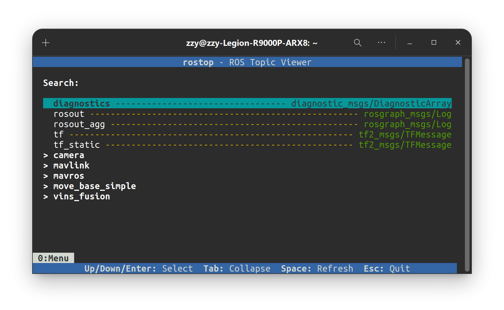
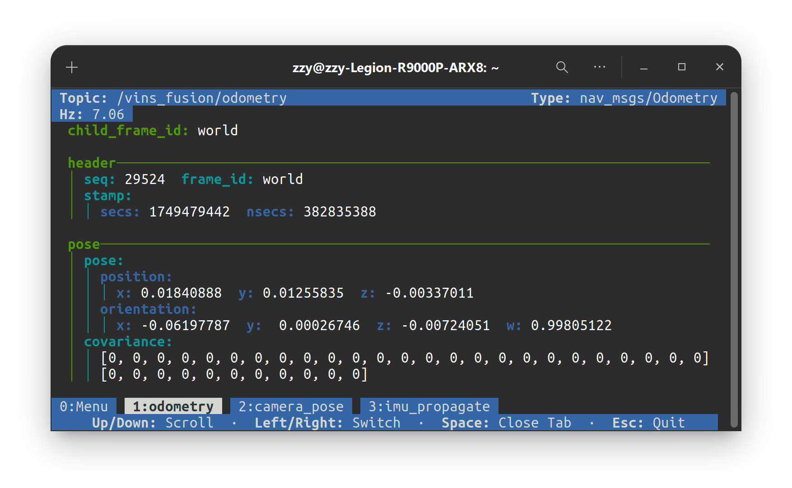

# rostop - 现代化的交互式ROS话题监控TUI

[简体中文](README.md)  |  [English](README_en.md)

`rostop` 是一个基于文本用户界面（TUI）的工具，用于实时监控ROS话题。它提供了一个比传统命令行工具（如 `rostopic echo`）更现代、更具交互性的体验，又能在命令行终端中便捷使用而无需桌面环境。  

此外，由于本项目的开发目的是为了在远程SSH连接方式下调试项目，因此同时随附一份[远程SSH连接指南](remote_SSH_guidance/远程SSH配置指南.md)，在Ubuntu20.04环境中使用[Tabby](https://github.com/Eugeny/tabby)（非常好用且美观！感谢！）进行配置、连接的过程。



## 安装指南

仅在ROS Noetic环境下测试通过，Python版本至少为3.8。
1.  **使用pip安装**：
```bash
pip install rostop
```
2.  **从源代码安装**：   
```bash
git clone https://github.com/ZhangZiyu1216/rostop
pip install .
```
## 使用方法

安装完成后，您可以在终端中直接运行：
```bash
rostop
```

程序启动后，您将看到一个菜单界面：
*   按**上下方向键**在话题列表中导航
*   按**回车键**选择一个话题以查看其详细数据
*   按**Tab键**可以折叠多级话题
*   按**空格键**刷新话题列表
*   输入**字母、数字、下划线**以搜索话题，当然也可以按**退格**键删除。

在数据查看界面：  
*   按**上下方向键**可以滚动显示内容（如果数据过长）
*   按**左右方向键**可以切换不同的标签页
*   按**Tab键**可以在美化的格式化数据和原始数据显示之间切换
*   按**空格键**可以关闭当前标签页
*   按**ESC键**退出程序

## 贡献

感谢Gemini-2.5，ChatGPT-o4和Claude-4。欢迎对本项目做出贡献！如果您有任何建议、发现bug或想添加新功能，请随时提交Pull Request或创建Issue。由于我只是一名忙于学业的学生，因此对该项目的回复和解答可能不及时，敬请谅解。

## 许可证

本项目采用 [MIT许可证](LICENSE)。
