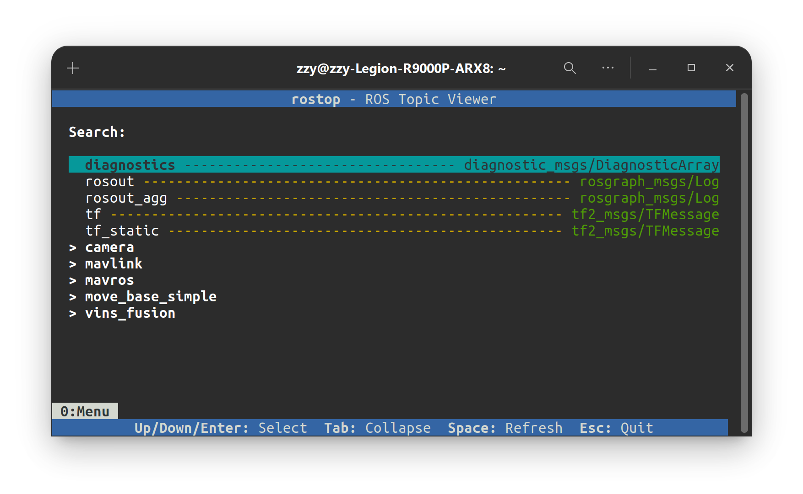

# rostop - A Modern, Interactive TUI for Monitoring ROS Topics

[简体中文](README.md)  |  [English](README_en.md)

`rostop` is a text-based user interface (TUI) tool for real-time monitoring of ROS topics. It offers a more modern and interactive experience compared to traditional command-line tools (such as `rostopic echo`), while remaining lightweight and usable directly in a terminal without a desktop environment.

In addition to its core functionality, this project includes a remote SSH connection guide for debugging in a headless environment. The guide covers configuring and connecting with [Tabby](https://github.com/Eugeny/tabby) on Ubuntu 20.04 (highly recommended for its aesthetics and usability).



## Installation

Tested on ROS Noetic with Python 3.8 or higher.

1. **Install via pip**

   ```bash
   pip install rostop
   ```

2. **Install from source**

   ```bash
   git clone https://github.com/ZhangZiyu1216/rostop
   cd rostop
   pip install .
   ```

## Usage

After installation, simply run:

```bash
rostop
```

Once launched, you'll see a menu interface where you can:

- Navigate the topic list using the **Up/Down arrow keys**
- Press **Enter** to select a topic and view details
- Collapse nested topics with **Tab**
- Refresh the topic list with **Space**
- Filter topics by typing **letters, numbers, or underscores**; use **Backspace** to delete

In the detail view:

- Scroll content with **Up/Down**
- Switch between pages with **Left/Right**
- Toggle between formatted and raw display with **Tab**
- Close the current page with **Space**
- Exit the program with **Esc**

## Contribution

Thanks to Gemini-2.5, ChatGPT-o4, and Claude-4 for support. Contributions are welcome! Feel free to submit issues or pull requests. As a student with limited time, responses may be delayed—thank you for your understanding.

## License

This project is released under the MIT License.
