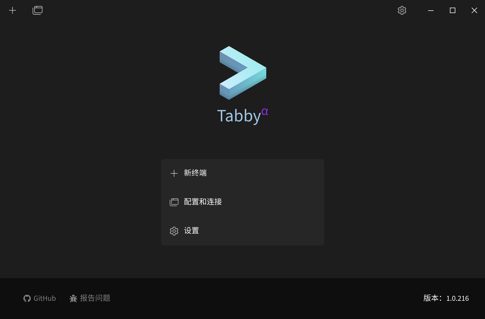
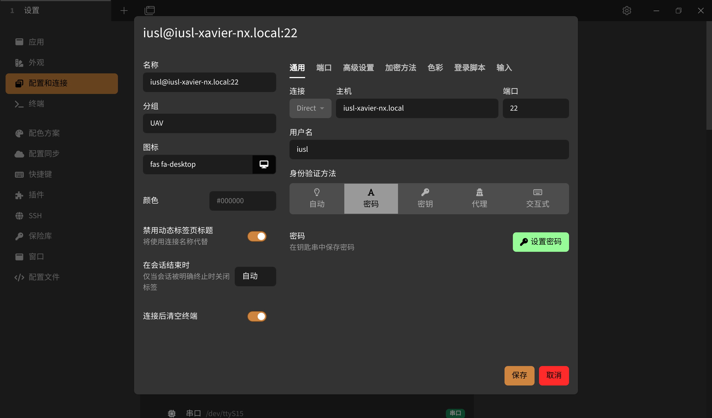
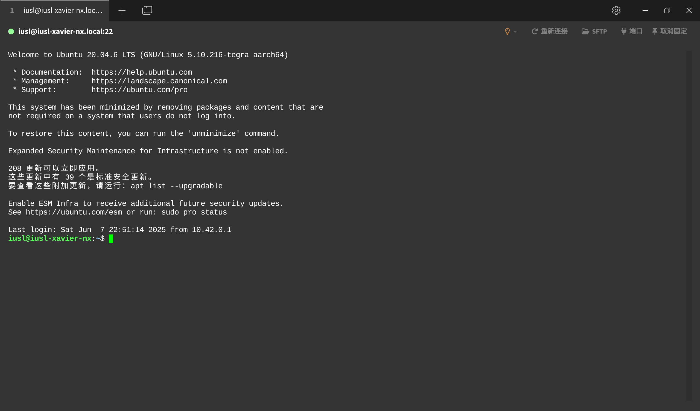
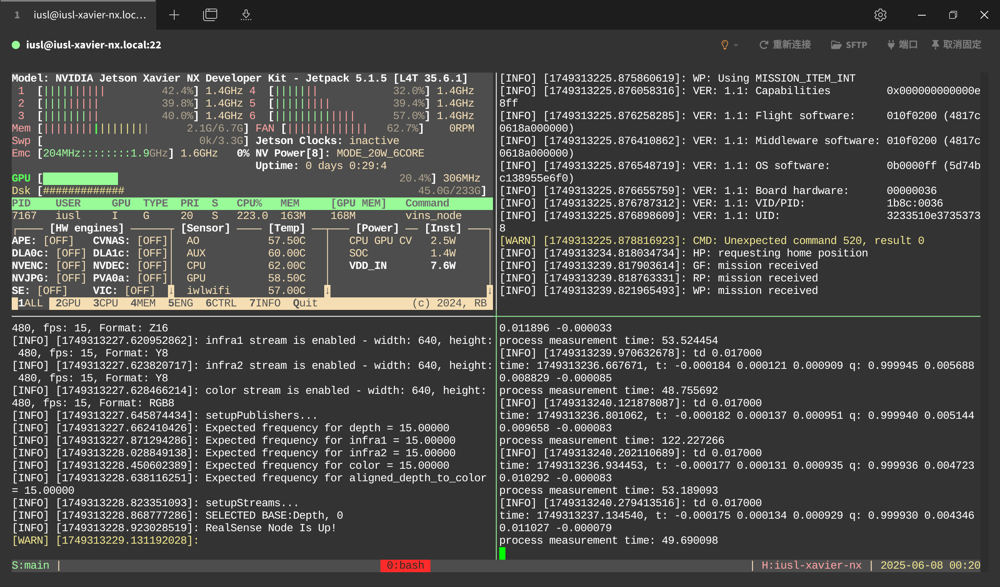

# Remote SSH Configuration Guide

[简体中文](远程SSH配置指南.md)  |  [English](Remote_SSH_Guide.md)

For onboard computers with low CPU performance, using remote desktop tools like NoMachine for remote operations can be very resource-intensive. However, using traditional SSH connections in the terminal is inconvenient: requiring IP input, binding processes to windows, and lacking multi-terminal/window support. Therefore, an elegant and practical remote SSH connection setup is necessary.

## Preparations
**0. Ensure that the onboard computer and your host can automatically connect to the same local network**

**1. Use the hostname to resolve the other party's IP**  
Although setting two routers with the same name and password allows computers to connect automatically, the IP may change.  
First, install:
```bash
sudo apt install avahi-daemon
systemctl status avahi-daemon # Check running status
```
Then set the hostname:
```bash
sudo hostnamectl set-hostname iusl-xavier-nx
```
Here, `iusl-xavier-nx` is the hostname you want to set. A restart is required after setting.  
If the setup is successful, run:
```bash
hostname
```
You should see if your hostname is correct.  
- Note: Hostnames in the local network must not conflict, so be cautious and consider whether other computers are using the same name.  
- In fact, the prefix displayed when starting the terminal, such as `zzy@zzy-Legion-R9000P-ARX8`, where `zzy` is the username, and `zzy-Legion-R9000P-ARX8` is the hostname.

Now you can test if you can ping the other party using the following:
```bash
ping iusl-xavier-nx.local
```
In practice, the `.local` method resolves the other party's IP.

**2. Install SSH services on both the onboard computer and your host**  
Execute the following commands in sequence:
```bash
sudo apt install openssh-server
sudo systemctl start ssh
sudo systemctl enable ssh
```

**3. Install the open-source SSH client Tabby**  
[Tabby](https://github.com/Eugeny/tabby) is a modern terminal connection tool that is open-source and cross-platform. Of course, you can use other tools or even directly use terminal SSH (not recommended). However, based on my personal experience, Tabby is very user-friendly and visually appealing.

Download the `.deb` file and install it. For **Ubuntu 20.04 systems**, download **v1.0.216 version** from the Release section. Testing shows that higher versions report NodeJS-related errors and fail to start on 20.04. For Windows, it should not matter.

After starting, it should look like this:  


Native support for Simplified Chinese is available. If it does not automatically display in Chinese, change it in the settings.

## Steps
**1. Set up a connection to the onboard computer**  
In Tabby, click Settings -> Configurations and Connections -> New -> New Configuration. In the dropdown list, select "SSH Connection".  
  
Connection: Direct.  
Host: iusl-xavier-nx.local (i.e., your hostname.local)  
Port: 22, do not change.  
Username: Your onboard computer's account name.  
Authentication method: Select "Password", set the password to your onboard computer's password, and save.  
Save after completing the setup.

Close the configuration page, return to the homepage, click "Configurations and Connections", and select the SSH connection you just created.  
If everything is normal, it will display:  


You can also open multiple windows.  
- Note: By default, the "+" next to the window opens your computer's terminal! Please click the button next to it and select the SSH configuration you just created to open the terminal page on the onboard computer. Alternatively, you can set the "Default setting for new tabs" to the SSH configuration you just created in Settings -> Configurations and Connections -> Configurations.  
- Note: This window is similar to a terminal window. If disconnected, tasks will be interrupted, so ensure a stable network connection.

To upload or edit files, click SFTP to open the file manager. For small files, you can directly right-click -> Local Edit, and it will automatically sync to the remote after saving locally. (Note: Files requiring sudo permissions cannot be edited this way; the save result will not take effect. You can only use vim to edit in SSH.)

**2. Set up the tmux terminal multiplexer**  
To: (1) Configure multiple terminal pages in SSH, (2) Prevent processes in the terminal from being killed due to accidental window closure, we use tmux to execute terminal commands.  
Install it with the following command:
```bash
sudo apt install tmux
```
Run tmux, and you will see the tmux session appear.

- The logic of tmux is based on session -> window -> pane. A session is a combination of windows, and a window is a combination of panes (i.e., window splits). Commands can be executed in panes. tmux sessions are independent of the terminal. Even if you close the terminal page (or disconnect the SSH connection), the commands in the session will still run in the background (in other words, the terminal window is just a display interface for the tmux session).

To truly end all tmux sessions, enter the following command (in any terminal or window):
```bash
tmux kill-server
```
Or press `Ctrl+b`, then type a colon, then type `kill-server` and press Enter in the active tmux terminal. There are many practical uses for tmux, which will not be elaborated here.

To facilitate usage (especially mouse operations), you need to configure the tmux configuration file. Execute the following in SSH:
```bash
vim ~/.tmux.conf
```
Then copy the following content into it (press `i` to enter edit mode, then `Ctrl+Shift+V` to paste, then press `Esc` to exit edit mode, and finally type `:wq` and press Enter to exit):
```bash
# ~/.tmux.conf

# Enable mouse mode to allow selecting panes, resizing, and scrolling history with the mouse
set -g mouse on

# Enable 256-color support for better colors in programs like vim
set -g default-terminal "screen-256color"

# Status bar settings
set -g status-bg black          # Status bar background color
set -g status-fg white          # Status bar foreground color
set -g status-interval 1        # Status bar refresh interval (seconds)
set -g status-justify centre    # Center window list

# Left status bar content: session name
set -g status-left '#[fg=green]S:#S #[fg=white]| '

# Right status bar content: hostname | date | time
set -g status-right '#[fg=white]| #[fg=cyan]H:#H #[fg=white]| #[fg=yellow]%Y-%m-%d %H:%M'

# Window list style
set-window-option -g window-status-current-style bg=red,fg=white # Current window style
set-window-option -g window-status-format ' #I:#W '             # Non-current window format (number:name)
set-window-option -g window-status-current-format ' #I:#W '      # Current window format
```
There are many tmux configurations available online. The above configuration includes some practical features, but you can use your own configuration.  
Now tmux can be used normally.  
I have prepared a sample startup script for tmux: `example.sh`:
```bash
#!/bin/bash

# =================================================================================
# Configuration Area (Command index starts from 0, configure as needed, windows will adapt automatically)
# =================================================================================

# --- Session Name Definition ---
SESSION_NAME="main"

# --- Command Definitions ---
COMMANDS=(
# -- [0] -- #
' jtop '
# -- [1] -- #
' bash -c "sudo chmod 777 /dev/ttyACM0; roslaunch mavros px4.launch; exec bash" '
# -- [2] -- #
' bash -c "roslaunch realsense2_camera rs_camera.launch --wait; exec bash" '
# -- [3] -- #
' bash -c "sleep 5; roslaunch vins vins.launch --wait; exec bash" '
# Add more commands in the array as needed
)

# =================================================================================
# Execution Area (Do not modify unless necessary)
# =================================================================================

# Get the number of commands
readonly NUM_COMMANDS=${#COMMANDS[@]}

if [ $NUM_COMMANDS -eq 0 ]; then
    echo "Command array is empty."
    exit 1
fi

# Adaptive window splitting
tmux new-session -d -s $SESSION_NAME
for i in $(seq 1 $(($NUM_COMMANDS - 1))); do
    if [ $(($i % 2)) -ne 0 ]; then #
        tmux split-window -h -t $SESSION_NAME:0
    else
        tmux split-window -v -t $SESSION_NAME:0
    fi
    tmux select-layout -t $SESSION_NAME:0 tiled
done

# Send commands
for i in $(seq 0 $(($NUM_COMMANDS - 1))); do
    PANE_INDEX=$i
    tmux send-keys -t $SESSION_NAME:0.$PANE_INDEX "${COMMANDS[$i]}" C-m
done

# Attach to terminal
tmux attach-session -t $SESSION_NAME
```
- You may notice that before starting MAVROS, I executed `sudo chmod 777 /dev/ttyACM0` to grant permissions to the serial port. To make this command execute automatically without entering a password, you can:  
1. Execute `sudo visudo`  
2. Add the following line at the end of the opened file (using vim):  
`iusl   ALL=(ALL) NOPASSWD: ALL`  
Replace `iusl` with your username.  
- You may also notice that the `--wait` parameter is added after `roslaunch`. It is strongly recommended to keep it. `sleep` may not be very accurate, causing multiple launches to start almost simultaneously, resulting in run_id conflicts and errors.  
- You may not notice that in MAVROS, the address for bridging QGC can also be specified using the `.local` method. For example, you can modify these two parameters in `px4.launch` as follows:
```xml
	<arg name="fcu_url" default="/dev/ttyACM0:2000000" />
	<arg name="gcs_url" default="udp://@zzy-Legion-R9000P-ARX8.local:14550" />
```
Here, `ttyACM0` is the actual connected serial port name (if you use USB, it follows the USB-CDC-ACM protocol, and the baud rate does not matter), and `zzy-Legion-R9000P-ARX8` is the hostname of the host you want to run QGC on (it is not recommended to perform sensor calibration when bridging QGC via UDP).

Simply add or remove commands in the `COMMANDS` array (separated by newlines), and the script will automatically split windows and execute them. The execution effect of the above commands is as follows:  


Now you can try closing this SSH connection window, opening a new one, and executing:
```bash
tmux ls
```
You will see that your `main` session is still running. Then display it again:
```bash
tmux at -t main
```
Your session is back. This shows that tmux terminals are independent of SSH windows. As long as you do not kill it, it will always exist, even if the network disconnects and the SSH window disappears.

You can also try adding commands to the above script to see how the window layout changes.

**4. Configure ROS Master/Slave (Optional)**  
Only applicable to single drones. For ROS1 communication, its reliance on the master mechanism makes multi-machine communication fragile. Although there are some third-party solutions, they are generally not effective and difficult to implement.

Generally, set your drone as the ROS master and your laptop as the ROS slave.  
Edit `.bashrc` on the onboard computer and add the following two lines at the end:  
```bash
export ROS_MASTER_URI=http://iusl-xavier-nx.local:11311
export ROS_HOSTNAME=iusl-xavier-nx.local
```
Replace `iusl-xavier-nx` with the hostname of your onboard computer.  
Then edit `.bashrc` on your laptop and add the following section at the end:
```bash
# =======================================================
# ROS Multi-Machine Environment Switching Function
# =======================================================

ROS_SESSION_FILE=~/.ros_session_mode
LOCAL_HOSTNAME="$(hostname).local"

function ros_connect() {
    if [ -z "$1" ]; then
        echo -e "\033[31m[Error] Please provide the target robot's hostname.\033[0m"
        echo "Usage: ros_connect <robot_hostname>"
        return 1
    fi

    TARGET_HOST="$1"
    # Set environment variables for the current terminal
    export ROS_MASTER_URI=http://${TARGET_HOST}.local:11311
    export ROS_HOSTNAME=${LOCAL_HOSTNAME}
    echo "${TARGET_HOST}" > "${ROS_SESSION_FILE}"

    _update_ros_prompt
}

function ros_local() {
    unset ROS_MASTER_URI
    unset ROS_HOSTNAME

    rm -f "${ROS_SESSION_FILE}"
    _update_ros_prompt
}


if [ -z "$regular_PS1" ]; then
    regular_PS1=$PS1
fi

function _update_ros_prompt() {
    if [[ -n "$ROS_MASTER_URI" && "$ROS_MASTER_URI" != *"localhost"* ]]; then
        ROS_MODE_PROMPT="(\033[32mROS Slave Mode\033[0m) "
    else
        ROS_MODE_PROMPT=""
    fi
    PS1="${ROS_MODE_PROMPT}${regular_PS1}"
}

PROMPT_COMMAND="_update_ros_prompt"

if [ -f "${ROS_SESSION_FILE}" ]; then
    SAVED_HOST=$(cat "${ROS_SESSION_FILE}")
    if [ -n "$SAVED_HOST" ]; then
        ros_connect "$SAVED_HOST" > /dev/null 
    fi
fi

_update_ros_prompt
# =======================================================
```
This is to set the local machine as a slave when needed (since the slave cannot run `roscore` independently, if you want to run other ROS programs on the local machine, you need to configure it).

To switch to ROS slave mode, open the terminal and execute:
```bash
ros_connect iusl-xavier-nx
```
Replace `iusl-xavier-nx` with the `hostname` of the onboard computer you want to connect to. After switching, the terminal prompt will display "ROS Slave Mode" before the prompt.

To switch back to master mode, open the terminal and execute:
```bash
ros_local
```

**5. Use VSCode Remote SSH for remote code editing (Optional)**  
To avoid repeatedly copying code, you can use VSCode's SSH feature for remote code editing.  
Refer to the tutorial at https://developer.aliyun.com/article/1626959 for configuration. The only difference is that when entering the SSH command, do not enter the IP address, but:
```bash
ssh iusl@iusl-xavier-nx.local
```
Where `iusl` is the username, and `iusl-xavier-nx.local` is the hostname.
